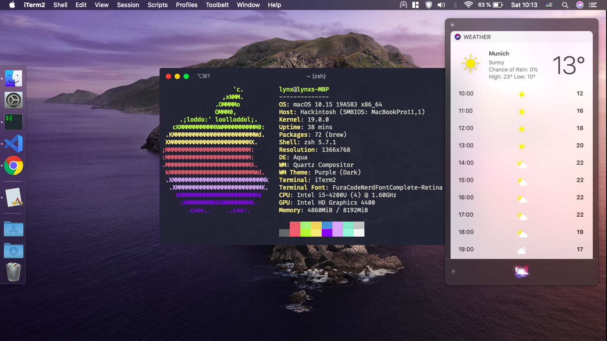

# Lenovo Flex 15 59416277

**Notes for macOS 12 Monterey:**

SMBIOS bumped to `MacBookPro12,1` since Monterey dropped support for older Macs.

Installer will not boot on without proper power management since macOS 10.15.
Booting from USB will either require installing with a port limit patch + USB2 or my USBMap.kext.
My USBMap will only work for `MacBookPro12,1` SMBIOS.

Inbuilt Intel WiFi may work with [itlwm](https://github.com/OpenIntelWireless/itlwm), but can't test since I sold and replaced. I use Broadcom BCM94352HMB (only use Brcm kexts if you also have this setup).

Either way make sure using `BlueToolFixup.kext` instead of `BrcmBluetoothInjector.kext` or `IntelBluetoothInjector.kext` on macOS 12.

What works (as of macOS **12 beta 2**):

- Ethernet
- USB / Card Reader
- Battery Status (patched)
- Multi-touch Trackpad Gestures
- Hotkeys for Audio and Brightness (patched)
- Audio
  - Out: Speakers, Jack and HDMI
  - In: Webcam (Motherboard does not support combojack input)
- Webcam + Microphone
- WIFI/Bluetooth - Broadcom BCM94352HMB (see BIOS whitelist removal)
- Sleep / Wake

Not working:

- Touchscreen

Links:

- [AppleHDA for Realtek ALC283](https://www.tonymacx86.com/threads/solved-help-fixing-applehda-for-realtek-alc283.165181/page-4)
- [Broadcom WiFi/Bluetooth [Guide]](https://www.tonymacx86.com/threads/broadcom-wifi-bluetooth-guide.242423/#post-1664577)
- [BrcmPatchRAM](https://github.com/acidanthera/BrcmPatchRAM)

Also big thanks to RehabMan for all his amazing resources.

## Flashing your BIOS / Whitelist removal

### Only do this with guidance of an expert

You **won't** be able to flash a new BIOS from a USB stick since this is write protected (even with sleep bug). This laptop sadly has no Libreboot / Coreboot support, so you will need to get someone to unlock your image for you.

Order those two parts online:

- [SPI Programmer](http://www.ebay.de/itm/25-SPI-Serie-24-EEPROM-CH341A-BIOS-Writer-Routing-LCD-Flash-USB-Programmierer-S7/282248666466?_trksid=p2047675.c100011.m1850&_trkparms=aid%3D222007%26algo%3DSIC.MBE%26ao%3D1%26asc%3D42849%26meid%3D01ae9da74f4f4c93a1270e4bf7c08b36%26pid%3D100011%26rk%3D1%26rkt%3D3%26sd%3D141466709787)
- [SOIC8 CLIP](http://www.ebay.de/itm/SOIC8-SOP8-Flash-Chip-IC-Test-Clips-Socket-Adpter-BIOS-24-25-93-Programmer-MF/182230151497?_trksid=p2047675.c100011.m1850&_trkparms=aid%3D222007%26algo%3DSIC.MBE%26ao%3D1%26asc%3D42849%26meid%3D01ae9da74f4f4c93a1270e4bf7c08b36%26pid%3D100011%26rk%3D2%26rkt%3D3%26sd%3D141466709787)

Then follow the following steps:

1. Get in touch with an expert [bios-mods](http://www.bios-mods.com) (or contact the guy who helped me at pythonic2016@gmail.com). I don't get paid for linking this, I am just happy with the result and their work. Consider giving them a good tip!

2. Once you have a person to help you. Open up your laptop and unplug your batteries (CMOS and the main battery that you need to remove in order to open up the laptop).
   
3. Locate your BIOS Chip (W25Q64BV ID:0xEF4017 Size: 8192KB). In terms of connecting the clip cable make sure PIN 1 of SPI and the Chip; there is a little mark; are connected (HQ Images on Github).
   

4. Use the Software (CH341A) provided by your expert and create a dump. Send it to him and he will provide you with a new flashable image.

5. You should be done if you did everything right. Test your laptop and if everything works upgrade your hardware!

## Installation

- Add Serial / UUID / MLB for `MacBookPro12,1`
- Remove / Disable Brcm Kexts if you don't use a Broadcom card.
- Run the install command for ALCPlugFix if you face AUX hotplug issues (see misc)

## Manually creating DSDT/SSDT files

Read up on one of RehabMan's guides and apply following patches:

- DSDT
  - IRQ Fix
  - Audio Layout 3
  - My brightness control patch
  - Lenovo Ux10-Z580 battery patch
  - Add IMEI
  - Fix Mutex with non-zero SyncLevel
  - OS Check Fix (Windows 8)
  - RTC fix
  - HPET Fix
  - Fix \_WAK Arg0 v2
  - USB3 \_PWR 0x6D (instant wake)
- SSDT-3-CB-01 (with changed layout-id 3)
  - Rename B0D3 to HDAU
