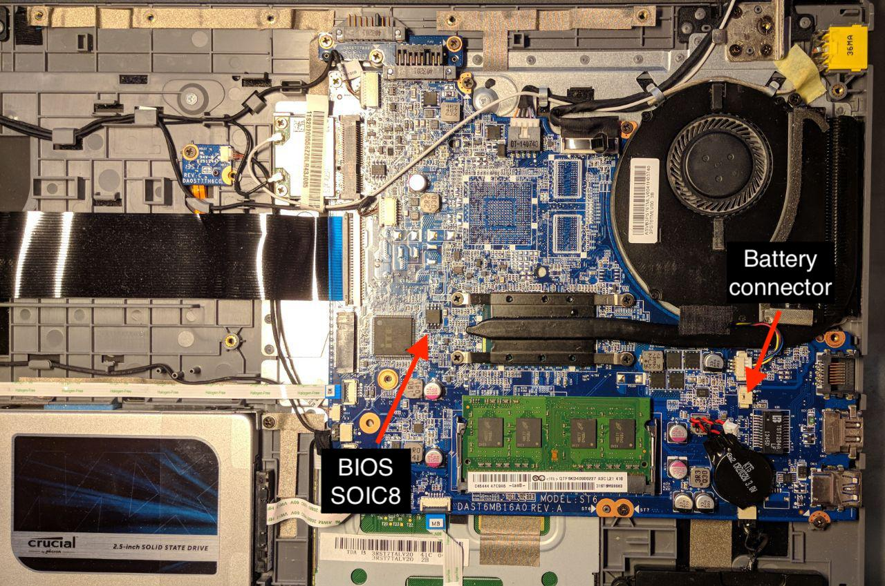
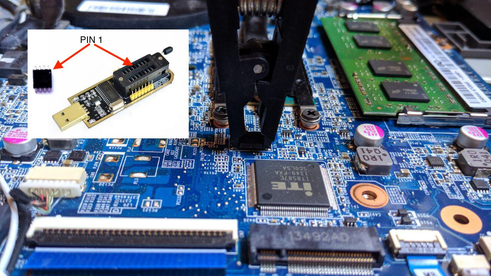

# Lenovo Flex 15 59416277

**Notes for macOS Mojave:**

No big compatibility issues there. The patched audio layout for High Sierra worked also for Mojave. The only thing that needed to be updated is Clover (use the latest version of Rehabmans repo currently: **r4658**) and **Lilu / AppleHDA** kexts. I had issues updating directly from High Sierra on multiple systems (worked it around with installing from a vanilla USB). The *works* list below has been already tested by myself. No compatibility issues as of now.


What works (currently using macOS **10.14**):
  - Ethernet
  - Touchscreen
  - USB / Card Reader
  - Battery Status (patched)
  - Multi-touch Trackpad Gestures
  - Hotkeys for Audio and Brightness (patched)
  - Audio (Speakers, Jack and HDMI), Webcam + Microphone
    > If it breaks reboot without kextcache and run: sudo touch /System/Library/Extensions && sudo kextcache -u /
  - WIFI/Bluetooth (You can replace this with with Broadcom BCM94352HMB if you flash your BIOS (tutorial provided here))
  - Sleep / Wake

What does not work:
  - Mic over Combojack (also not supported on any other OS)
  - Hibernation

Based on (Big thanks to RehabMan):
  - [Laptop backlight control using AppleBacklightInjector.kext](https://www.tonymacx86.com/threads/guide-laptop-backlight-control-using-applebacklightinjector-kext.218222/)
  - [AppleHDA for Realtek ALC283](https://www.tonymacx86.com/threads/solved-help-fixing-applehda-for-realtek-alc283.165181/page-4)
  - [Intel IGPU HDMI/DP audio](https://www.tonymacx86.com/threads/guide-intel-igpu-hdmi-dp-audio-sandy-ivy-haswell-broadwell-skylake.189495/)
  - [Broadcom WiFi/Bluetooth [Guide]](https://www.tonymacx86.com/threads/broadcom-wifi-bluetooth-guide.242423/#post-1664577)

### Flashing your BIOS / Whitelist removal
##### Only do this with guidance of an expert or this can go bad!!!

You **won't** be able to flash a new bios from a usb stick since this is write protected (even with sleep bug). This laptop sadly has no Libreboot/Coreboot support, so you will need to get someone to unlock your image for you.

Order those two parts online:
  - [SPI Programmer](http://www.ebay.de/itm/25-SPI-Serie-24-EEPROM-CH341A-BIOS-Writer-Routing-LCD-Flash-USB-Programmierer-S7/282248666466?_trksid=p2047675.c100011.m1850&_trkparms=aid%3D222007%26algo%3DSIC.MBE%26ao%3D1%26asc%3D42849%26meid%3D01ae9da74f4f4c93a1270e4bf7c08b36%26pid%3D100011%26rk%3D1%26rkt%3D3%26sd%3D141466709787)  
  - [SOIC8 CLIP](http://www.ebay.de/itm/SOIC8-SOP8-Flash-Chip-IC-Test-Clips-Socket-Adpter-BIOS-24-25-93-Programmer-MF/182230151497?_trksid=p2047675.c100011.m1850&_trkparms=aid%3D222007%26algo%3DSIC.MBE%26ao%3D1%26asc%3D42849%26meid%3D01ae9da74f4f4c93a1270e4bf7c08b36%26pid%3D100011%26rk%3D2%26rkt%3D3%26sd%3D141466709787)

Then follow the following steps:

1. Get in touch with an expert [bios-mods](http://www.bios-mods.com) (or contact the guy who helped me at pythonic2016@gmail.com). I don't get paid for linking this, I am just happy with the result and their work. Consider giving them a good tip!

2. Once you have a person to help you. Open up your laptop and unplug your batteries (CMOS and the main battery that you need to remove in order to open up the laptop).
  
3. Locate your BIOS Chip (W25Q64BV ID:0xEF4017 Size: 8192KB). In terms of connecting the clip cable make sure PIN 1 of SPI and the Chip; there is a little mark; are connected (HQ Images on Github).
  

4. Use the Software (CH341A) provided by your expert and create a dump. Send it to him and he will provide you with a new flashable image.

5. You should be done if you did everything right. Test your laptop and if everything works upgrade your hardware!
### Installation
- copy kext files to L/E (add the kexts in broadcom folders if you flashed your bios + installed the broadcom card I mentioned)
- copy or modify clover.plist and use the kexts in Other dir
- use my DSDT / SSDT or patch yourself (see below)
- do VoodooPS2 install (see misc)
     ```
    # Remove conflicting kexts
    sudo rm -rf /System/Library/Extensions/AppleACPIPS2Nub.kext
    sudo rm -rf /System/Library/Extensions/ApplePS2Controller.kext
    # add the Daemon to startup
    sudo cp org.rehabman.voodoo.driver.Daemon.plist /Library/LaunchDaemons
    sudo cp VoodooPS2Daemon /usr/bin
    ```
- run the Trackpad install script in "Install Trackpad" (else you will have no tap to click)
- setup three finger gestures in Keyboard Settings (they emulate keystrokes as workaround)

### Manually creating DSDT/SSDT files
Read up on one of RehabMan's guides and apply following patches:
- DSDT
  - IRQ Fix
  - Audio Layout 3
  - My brightness control patch
  - Lenovo Ux10-Z580 battery patch
  - Add IMEI
  - Fix Mutex with non-zero SyncLevel
  - OS Check Fix (Windows 8)
  - RTC fix
  - HPET Fix
  - Fix _WAK Arg0 v2
  - USB3 _PWR 0x6D (instant wake)
- SSDT-3-CB-01 (with changed layout-id 3)
  - rename B0D3 to HDAU
